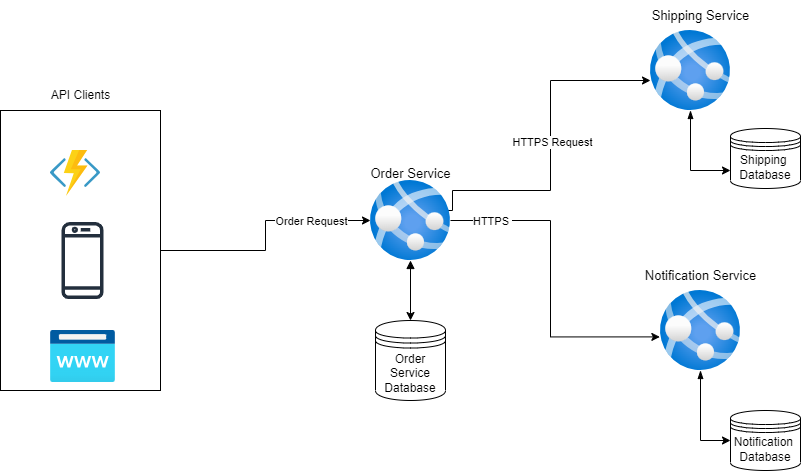
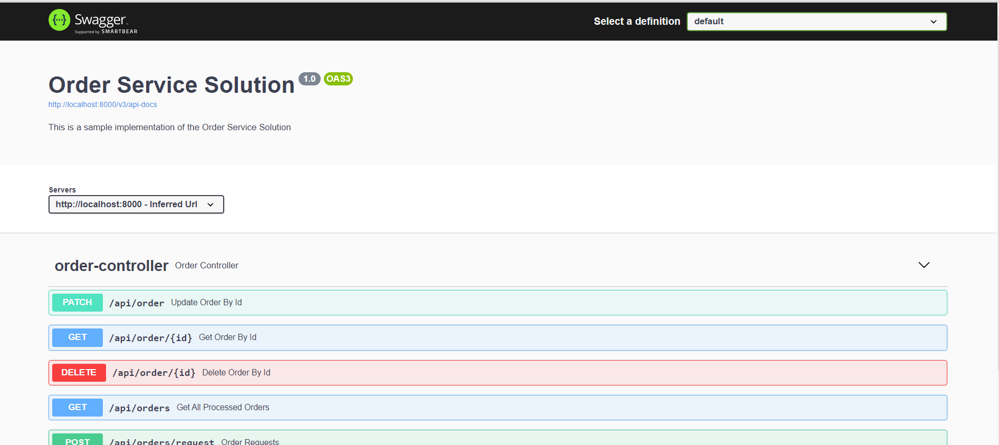

# E-Commerce Order Service Microservice

This document explains the backend API which for Order Service Microservice
The service receives an order, creates a record in the database, then calls th shipping service and notification service.


## Project Basics
### Java Version
The application has been developed using Java version
```
8
```

### Spring Version
The application has been developed on spring version
```
'org.springframework.boot' version '2.7.15'
```

When the application is run locally, it launches the tomcat server running on:
- server port: ```8000```
- [localhost](http://localhost:7000)
- [Swagger UI](http://localhost:8000/swagger-ui/index.html)

### API Documentation
- The API documentation has been done using Swagger Docs - version 3
- Once the application is run, the documentation page can be accessed through [Swagger UI](http://localhost:8000/swagger-ui/index.html)



### Tools used
- Intellij IDEA - Ultimate Edition
- Access h2 in-mem database console
  [h2 in-memory database console link](http://127.0.0.1:8000/h2-console/login.jsp)
  Username, Password and database name can be found in the ```application.properties``` file.

### Database
The service has been configured to use an in-memory database (h2) to fasten the development process as well as to it easier to set up the service 
by any dev who may want to check it out

More details about h2 database can be found via [h2 database](https://www.baeldung.com/spring-boot-h2-database)


## How to set up
Once the project is cloned from GitHub to the local instance, one can run it through 
- Open it in Intellij and just use the IDE to run it. Please make sure that you have ```Java 8 or higher``` installed on your computer.
- One can also run it using the command ```gradle bootRun```


## Endpoints Implemented
The Order service exposes the following endpoints:
- POST ```/api/orders/request``` for creating a new order request
- GET ```/api/order/{id}``` for getting order by id
- GET ```/api/orders```  for getting all processed orders
- PATCH ```/api/order``` for updating an order
- DELETE ```/api/order/{id}``` for deleting an order
 
## Considerations
On application start, the service seeds the database by creating some default information which is required
- Creates sample customers and logs the list of created customers on in the log file and on the console
- Creates sample products and logs the list of created products on in the log file and on the console
- The Notification and Shipping services are not able to make actual calls to the underlying services since they don't exist


